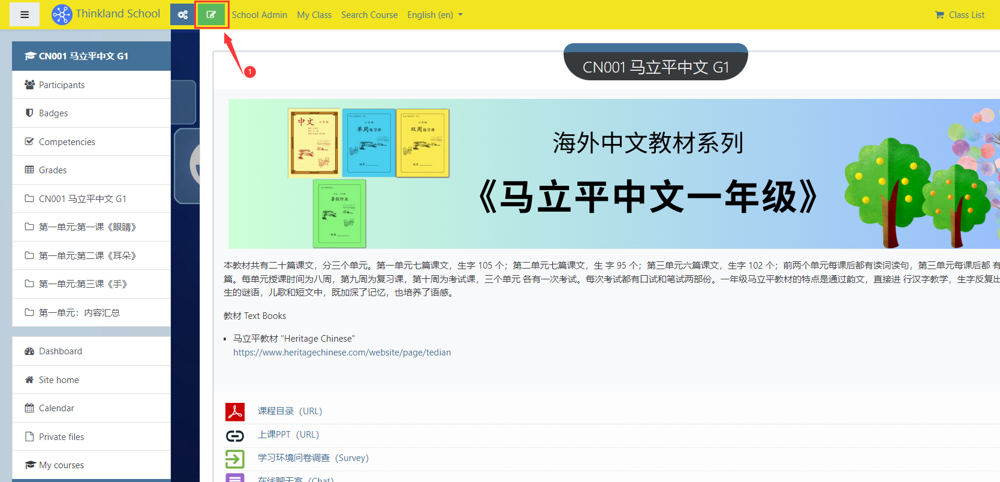
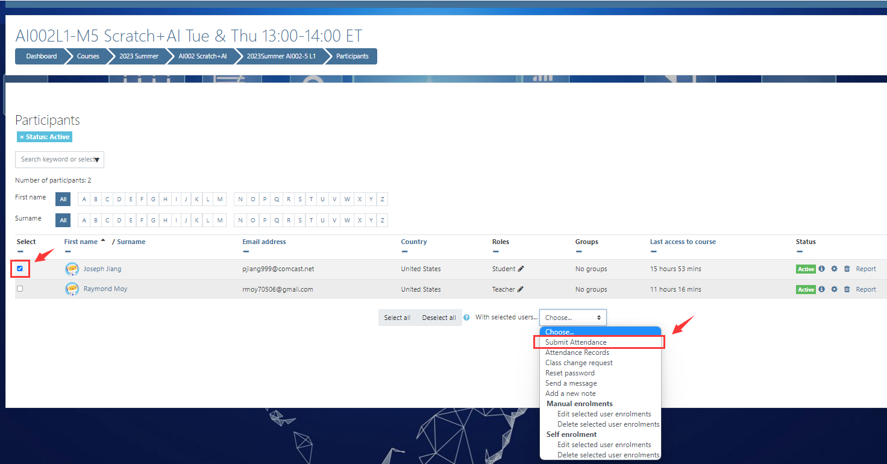
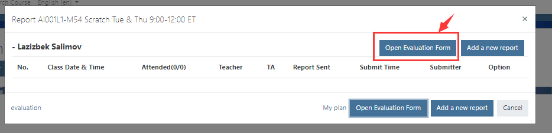
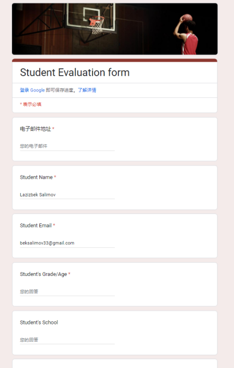

# Teacher

[Teachers Manual](https://school.thinkland.ai/teacher-manual/)

## I. Pre-class phase

### 1. Self-registration account
   - Open learning platform https://demo.thinkland.ai/login/index.php login interface
   - Click`Create new account`
   - Fill in the registration information and click 'Create my new account' to submit

     
     
     
   - Go to the email address used to register and find the registration confirmation email
   - Click the link in the email to complete the account registration
     

### 2．Class information email, sent by the operation
   - Email (to teacher): Class Information: 2023Spring AI005-21 L3 Thu 6:00-7:30pm

   ```

Subject: Teaching Class: 2023Spring AI005-21 Java L3 Thu 6:00-7:30pm

Dear Ananya Agarwal,

Congratulations! You will be teaching. Here is your class information:
- Class Name: AI005L3-21-2023S Java Level 3 (Class Link)
- Class time: Thu 6:00-7:30pm (America/Chicago Time Zone)
- Class start date: 2/2/2023
- Number of classes: 16
You can access class information on your mobile phone at https://thinkland.ai/myclass/

Student list: Link
1. Alan Chen (alanchenhappy9@gmail.com)
2. Victor Feng (LLAN012345@gmail.com)
3. Jerry Yu (jasmine080429@gmail.com)

To start a class:
1). Log in https://school.thinkland.ai/ to prepare your class 10 minutes before the start time.

2). Sign in https://zoom.us as Host 5 minutes before the start, for Zoom may check security passcode.
- Teacher Sign-in Email: z7@thinklandai.com
- Password: Code@2022
If you are prompted for OPT (One-Time Passcode), check here: https://app.thinkland.ai/zoom

FYI only - student’s Zoom entry:
https://zoom.us/j/7760428125?pwd=ZFZ1Tm4zRytFZjRZNjN4NXFCREpUZz09
- Meeting ID: 776 042 8125 (Passcode: 123456)

3). Must submit attendance at the beginning of the class. (how to submit class attendance)

4). After class ends, submit reports for your students, TA and yourself. (how to submit class report)

For more information such as teaching pay, check out Teacher FAQ


Best Regards,
Thinkland.ai Office

   ```
### 3．Teacher：Check Class Calendar
   - Teachers log in to the learning platform, click the "My Class" button in the upper left corner, enter their name to view

       
       

### 4．Class reminder email, automatically sent by the system (7am on the same day)
   - Email (to teacher): Teaching Reminder Today：2023Spring AI005-21 L3 6:00-7:30pm 
    ` [7am on the day of the class]`

   ```

Dear Ananya,

You are teaching this class today:
- Class# 4/16: AI005L3-21-2023S at 6:00-7:30pm your local time on 3/16/2023

Student list: Link
1. Alan Chen (alanchenhappy9@gmail.com)
2. Victor Feng (LLAN012345@gmail.com)

To start the class:
1). Log in Class to prepare 10 minutes before the start time.

2). Sign in Zoom 5 minutes before the start. If prompted for OPT, check ZoomCode
- Teacher Sign-in Email: z7@thinklandai.com; Password: Code@2022

FYI only - student’s Zoom entry:
https://zoom.us/j/7760428125?pwd=ZFZ1Tm4zRytFZjRZNjN4NXFCREpUZz09
- Meeting ID: 776 042 8125 (Passcode: 123456)

If you can't teach today, click here to submit a class change request NOW.


Best Regards,
Thinkland.ai Office

   ```

### 5．Pre-class reminder email, automatically sent by the system (sent one hour before class)
   - Email (to teacher): Teaching Reminder Today：2023Spring AP410-1 7:00-8:00pm
    ` [one hour before the class start time]`

   ```

Dear Ananya,

AI005L2-25-2023S class starts in 1 hour at 5:00pm.

1). Be sure to enter your class at https://school.thinkland.ai/ 10 minutes before the class time.
2). Sign in Zoom 5 minutes before the start. If prompted for OPT, check ZoomCode
- Teacher Sign-in Email: z7@thinklandai.com; Password: Code@2022

You MUST submit attendance at the beginning of the class (within 10 minutes).


Best Regards,
Thinkland.ai Office

   ```

### 6．Teacher：How to make Class Change Request
   - Log in to the learning platform, click the My Class button in the upper left corner, and enter your name to view it
   - Find the Class you want to submit a Class change to, click on "Class change request link" and fill out the form

       
            


### 7．Teacher：Send message to the students in your class

   
      
   
### 8．Teacher：Reset thinkland school login password for student

   
      
   
### 9．Teacher：Where are the classes you taught?
Method 1:
- Go to My Class
- Enter your name or email to see the class(es) that you are teaching now, (click "all class" will show all the classes you have taught)

   
  
Method 2:
- Login learning platform
      
      

### 10．Teacher：How to set homework and upload courseware
- Log in to the learning platform and click My course on the left navigation bar to enter the class

   

- Click the Edit button in the upper left corner to open the edit function

   

- Click Add an activity or resource to add course resources/activities

    

- The common functions of course resources/activities are mainly as follows：
  - Assignment：Teachers can be used to set homework
  - Chat:Online chat room function
  - Forum:Online discussion group
  - Interactive Content:Various types of interactive teaching H5P courseware can be made
  - Quiz:Quizzes can be set
  - Folder:You can set the file package
  - Label:Can be used to set label text
  - URL:Can be used to set up online files (documents placed on Google Cloud Drive), online video/audio

   
   

- Click Add topics to add a new chapter

   
  
- Examples：
Case template：[https://demo.thinkland.ai/course/view.php?id=290](https://demo.thinkland.ai/course/view.php?id=290)
Teacher : User name 'teacher’ , password ‘Thinkland@1'

## II, the class phase
### 1．Check on attendance
   - Check the student for Attendance and click Submit Attendance
     
   

### 2．Attendance reminder email, the system automatically sends
   - Email (to teacher): Attendance Reminder - 2023Spring AI002-10 L1

   ```

Hi Jojo Shum,

It's 08:00 2023-03-03 now.
AI002L1-10-2023S class starts at 19:00 2023-03-02 ET.
Please always submit student attendance at the start of class.
Click here to submit: https://school.thinkland.ai/user/index.php?id=1759

Why it is important to always submit class attendance at the start of the class::
1. Send a reminder message to absent students and/or their parents. You can submit multiple times.
2. Save a record of you starting the class on time, in case that the parents ask about it later.
3. We don’t want any student to miss a class. You can DM the OPERATION team (Derek, Dragon371#6098) in Discord to contact the parents through other ways such as text message.
4. How to submit: https://school.thinkland.ai/attendance/

Best Regards,
Thinkland.ai Office

   ```


   - Email (to teacher):  Attendance Reminder: Submit Now! 

     `if the class is 5 minutes over start time but still no attendance submitted, send a reminder to the teacher and Operation.`

   ```

Hi Jojo Shum,

It's 7:06pm 2023-03-02, 5 minutes past the start of class AI002L1-10-2023S Wed 19:00-20:00 ET.

Click here to submit class attendance now: https://school.thinkland.ai/user/index.php?id=1759

Why it is important to always submit class attendance at the start of the class::
1. Send a reminder message to absent students and/or their parents. You can submit multiple times.
2. Save a record of you starting the class on time, in case that the parents ask about it later.
3. We don’t want any student to miss a class. You can DM the OPERATION team (Derek, Dragon371#6098) in Discord to contact the parents through other ways such as text message.
4. How to submit: https://school.thinkland.ai/attendance/

Best Regards,
Thinkland.ai Office

   ```

   - Email (to teacher):  Reminder: Submit Attendance Earlier

     `When the teacher submits the attendance over 10 minutes.`

   ```

Hi Jojo Shum,

It's 7:26pm 2023-03-02.
Attendance was submitted LATE for your class AI002L1-10-2023S Wed 19:00-20:00 ET.

Why to submit class attendance at the start of the class？
1. We want to do our best to get students to come to the class on time. If you submitted at the beginning of the class, the no-show message might be able to get to the student/parents and remind them of the class.
2. If You can DM the OPERATION team (Derek, Dragon371#6098) in Discord earlier, they may be able to contact the parents through other ways such as text message.
3. Save a record of you starting the class ON TIME, in case that the parents ask about it later.

Best Regards,
Thinkland.ai Office

   ```


   - Email (to teacher):  No Attendance Submitted, do it now!

     `When no attendance is submitted at the end of the class.`

   ```

Hi Jojo Shum,

It's 20:01pm 2023-03-02.
Your class (AI002L1-10-2023S Wed 19:00-20:00 ET) just ended, but there is still no class attendance submitted.

Click here to submit now: https://school.thinkland.ai/user/index.php?id=1759

Best Regards,
Thinkland.ai Office

   ```


   - Email (to teacher):  Attendance was submitted late

     `When the teacher submits the attendance after the class end time.`

   ```

Hi Jojo Shum,

It's 8:26pm 2023-03-02.
Attendance was submitted after your class (AI002L1-10-2023S Wed 19:00-20:00 ET) had ended.

Please remember to submit class attendance at the start of the class, always!
It is important to do so, because
1. We want to do our best to get students to come to the class on time. If you submitted at the beginning of the class, the no-show message might be able to get to the student/parents and remind them of the class.
2. If You can DM the OPERATION team (Derek, Dragon371#6098) in Discord earlier, they may be able to contact the parents through other ways such as text message.
3. Save a record of you starting the class ON TIME, in case that the parents ask about it later.
4. How to submit: https://school.thinkland.ai/attendance/

Best Regards,
Thinkland.ai Office

   ```

## III, the after-school stage
### 1．Teacher：Add/Edit Class Report
   - Find your course at Myclass
   - Click the class title to enter the learning platform class page

 
 
 

### 2．Report filling reminder email, system automatically send (3 times)
   - Email (to teacher): Report Reminder 3/3：2022Fall AI003-19 L2 1on1

   ```

Dear teacher Satwika,

Please fill out your class report of AI003L2-F19 Python 1on1 Fri 20:00-21:00 ET on 3/3.

Click here to submit: https://school.thinkland.ai/user/index.php?id=1142

Best Regards,
Cloudy - the AI Bot

   ```
   - Email (to teacher): Report Reminder 3/2：2022Fall AI003-17 L3

   ```

Hello teacher Daniel,

It is 9:45pm 3/3 now. Please fill out your class report of 2022Fall AI003-17 L3 on 3/2.

Click here to submit: https://school.thinkland.ai/user/index.php?id=1140

Best Regards,
Cloudy - the AI Bot

   ```

   - Email (to teacher): Report Reminder 2/26：2023Spring Math202-2 L1

   ```

Hello teacher James,

It is 3:00pm 2/28 now. This is the third and last reminder for missing class report of 2023Spring Math202-2 L1 on 2/26.
Please sumbit for all students ASAP.

Click here to submit: https://school.thinkland.ai/user/index.php?id=1921

Best Regards,
Cloudy - the AI Bot

   ```

### 3．Teacher：Write students' evaluation and recommendation
   - How to write student evaluation & recommendation - check out the announcement: 
     
   
     
   

### 4．Evaluation fill in the reminder email, the system automatically sends (3 times)

     `2 classes left: send email on the day after the last 3rd class has finished`
   - *Email (to teacher): remind teacher write evaluation

   ```

Subject：Student Evaluation for your AI001L3-35 Scratch Tue 18:00-19:00 ET class

Hi Katherine,

Your AI001L3-35 Scratch Tue 18:00-19:00 ET class has 2 more classes remaining for this session. 

Could you please write the Evaluation and Recommendation for your students this week?
John Smith Student name: https://forms.gle/LCy7G21KguBLdV3R7

We need the time and information to communicate with their parents for class renewal next session.
Student renewal is very important to us, and to you as well (you will be the teacher if you can continue). Retention rate is the ONLY criteria we use to measure teaching quality, and judge your teaching performance.

Please provide as much information as you can - be encouraging but honest. FYI, below are some evaluation examples that other teachers have written:
- https://school.thinkland.ai/teachers/2534/439
- https://school.thinkland.ai/teachers/745/710
- https://school.thinkland.ai/teachers/4535/724
- https://drive.google.com/drive/u/3/folders/1EWC3ijexnTNqJhnP3hfe5_eHxKSnIkEg

Again, this is very important! 

Thank you so much
Thinkland.ai Office

   ```

     `1 classes left: send email on the day after the last 2nd class has finished`

   ```

Subject：Student Evaluation Reminder for your AI001L3-35 Scratch Tue 18:00-19:00 ET class

Hi Katherine,

Your AI001L3-35 Scratch Tue 18:00-19:00 ET class has ONE  last class next week. 

1. Please inform this to your students and their parents. Encourage them to sign up for the next level course (you will be the teacher if you can continue teaching). 
You can see our complete course structure here: https://school.thinkland.ai/courses.

2. Please click the links below to enter the Evaluation and Recommendation for your students:
John Smith Student name: https://forms.gle/LCy7G21KguBLdV3R7


The sooner you fill out the information, the better we are able to talk with the parents for class renewal. 

Please provide as much information as you can - be encouraging but honest. FYI, below are some evaluation examples that other teachers have written:
- https://school.thinkland.ai/teachers/2534/439
- https://school.thinkland.ai/teachers/745/710
- https://school.thinkland.ai/teachers/4535/724
- https://drive.google.com/drive/u/3/folders/1EWC3ijexnTNqJhnP3hfe5_eHxKSnIkEg

Again, this is very important for our school, for the students and parents. 

Thank you so much!
Mike

   ```


     `last class: send email after the teacher submit class attendance for the last class`

   ```

Subject：Student Evaluation: last class (AI001L3-35 Scratch Tue 18:00-19:00 ET)

Hi Katherine,

This is your LAST AI001L3-35 Scratch Tue 18:00-19:00 ET class. 

1. Please talk about this to your students in today’s class. Do your best to encourage them to sign up for the next level course (you will be the teacher if you can continue teaching). 
You can see our complete course structure here: https://school.thinkland.ai/courses.

2. If you have not done so, please enter the Evaluation and Recommendation for your students (click the links to enter each student’s evaluation form):
John Smith Student name: https://forms.gle/LCy7G21KguBLdV3R7


The sooner you fill out the information, the better we are able to talk with the parents for class renewal. 

Please provide as much information as you can - be encouraging but honest. FYI, below are some evaluation examples that other teachers have written:
- https://school.thinkland.ai/teachers/2534/439
- https://school.thinkland.ai/teachers/745/710
- https://school.thinkland.ai/teachers/4535/724
- https://drive.google.com/drive/u/3/folders/1EWC3ijexnTNqJhnP3hfe5_eHxKSnIkEg

Again, this is very important for our school, for the students and parents. 

Thank you so much!
Mike

   ```


## IV. Others
### 1．Teacher：[Teaching Logistics](https://docs.google.com/document/d/1LAoZkOSSqfF5TpiF7QLNrMTx4tU0UNbAD3GhI35YJGU/edit#bookmark=id.736o994hlnj)

### 2．Teacher：[School Rules](https://school.thinkland.ai/teacherrules.pdf)

