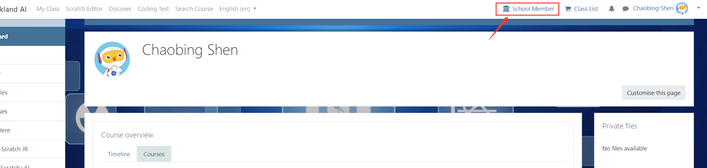
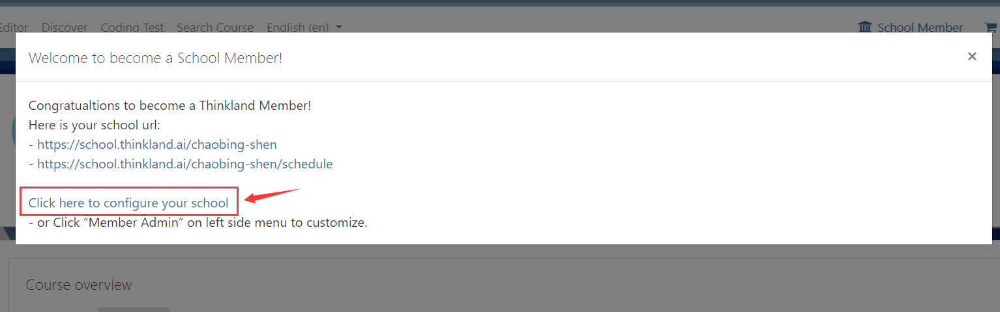
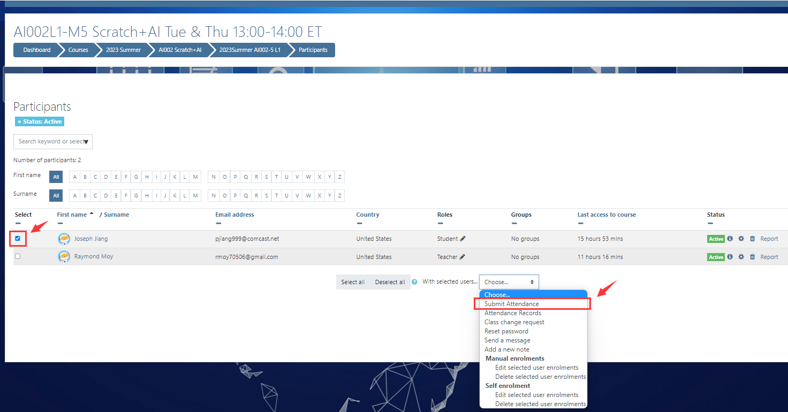
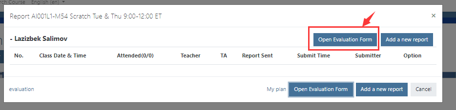
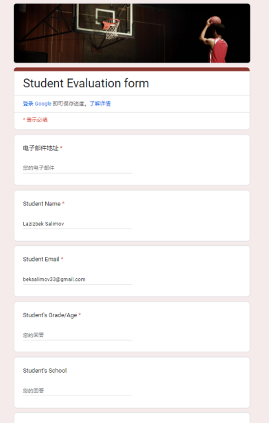

# Teacher
## Ⅰ. Pre-class
1．Become our School Member
   - Click `School Menber` in the upper right corner to become our menber (there will be an email reminder), and you can use the dedicated Schedule link for menber to promote courses. If students sign up through this link, they can get a commission
     
   

2．Setting up the `School Menber` page：[page settings](https://aigolearning-my.sharepoint.com/:p:/g/personal/robin_teensteachkids_org/EeryKRYisv9PsKJlDyhu3gwBkSGtWPjCNcL8Z4LX0bloeg?e=e2rttB&nav=eyJzSWQiOjQ4NCwiY0lkIjowfQ)
     
   

3．Teacher builds class independently
   - Fill in the [form](https://docs.google.com/forms/d/e/1FAIpQLSfgzA1Mn0JrMduZ4uXlTx9om2umCz1EI5KbGpnjrx73LXEZQw/viewform)，After the form is filled in, it can be displayed on the menber page after being approved by the system administrator

4．Class information email, sent by the operator
   - [Email (to teacher): Class Information: 2023Spring AI005-21 L3 Thu 6:00-7:30pm](https://docs.google.com/document/d/1LAoZkOSSqfF5TpiF7QLNrMTx4tU0UNbAD3GhI35YJGU/edit#bookmark=id.19qvptn8icb8)

5．Teacher：Check Class Calendar
   - To see class schedule, click Class Calendar at: https://thinkland.ai/myclass/

6．Class reminder email, automatically sent by the system (at 7 o'clock in the morning of the same day)
   - [Email (to teacher): Teaching Reminder Today：2023Spring AI005-21 L3 6:00-7:30pm](https://docs.google.com/document/d/1LAoZkOSSqfF5TpiF7QLNrMTx4tU0UNbAD3GhI35YJGU/edit#bookmark=id.n274tcfvki6k)
    ` [7am on the day of the class]`

7．Reminder email before class, automatically sent by the system (sent one hour before class)
   - [Teaching Reminder Today：2023Summer Lang101-14 L1 3:30-5:00pm](https://docs.google.com/document/d/1LAoZkOSSqfF5TpiF7QLNrMTx4tU0UNbAD3GhI35YJGU/edit#bookmark=id.k5l5bj366b0d)

8．Teacher：[Class Change Request](https://docs.google.com/document/d/1LAoZkOSSqfF5TpiF7QLNrMTx4tU0UNbAD3GhI35YJGU/edit#bookmark=id.8am1zhm1m9ih)

9．Teacher：[Send message to the students in your class](https://docs.google.com/document/d/1LAoZkOSSqfF5TpiF7QLNrMTx4tU0UNbAD3GhI35YJGU/edit#bookmark=id.8am1zhm1m9ih)

10．Teacher：[Reset thinkland school login password for student](https://docs.google.com/document/d/1LAoZkOSSqfF5TpiF7QLNrMTx4tU0UNbAD3GhI35YJGU/edit#bookmark=id.ye1zr7rx9nz2)

11．Teacher：[Populate the Classroom](https://docs.google.com/document/d/1LAoZkOSSqfF5TpiF7QLNrMTx4tU0UNbAD3GhI35YJGU/edit#bookmark=id.xucdcan6auk9)

## Ⅱ、In class

1．attendance
   - Tick ​​the students in attendance and click `Submit Attendance`
     
   

2．Attendance reminder email, automatically sent by the system

   - [Email (to teacher): Attendance Reminder - 2023Spring AI002-10 L1](https://docs.google.com/document/d/1LAoZkOSSqfF5TpiF7QLNrMTx4tU0UNbAD3GhI35YJGU/edit#bookmark=id.90zja3v6kw1)

   - [Email (to teacher):  Attendance Reminder: Submit Now!](https://docs.google.com/document/d/1LAoZkOSSqfF5TpiF7QLNrMTx4tU0UNbAD3GhI35YJGU/edit#bookmark=id.kal0hzs5josw)

     `if the class is 5 minutes over start time but still no attendance submitted, send a reminder to the teacher and Operation.` 

   - [Email (to teacher):  Reminder: Submit Attendance Earlier](https://docs.google.com/document/d/1LAoZkOSSqfF5TpiF7QLNrMTx4tU0UNbAD3GhI35YJGU/edit#bookmark=id.kal0hzs5josw)

     `When the teacher submits the attendance over 10 minutes.`

   - [Email (to teacher):  No Attendance Submitted, do it now!](https://docs.google.com/document/d/1LAoZkOSSqfF5TpiF7QLNrMTx4tU0UNbAD3GhI35YJGU/edit#bookmark=id.ufx6ggq25uf)

     `When no attendance is submitted at the end of the class.`

   - [Email (to teacher):  Attendance was submitted late](https://docs.google.com/document/d/1LAoZkOSSqfF5TpiF7QLNrMTx4tU0UNbAD3GhI35YJGU/edit#bookmark=id.u3amuaegodqa)

     `When the teacher submits the attendance after the class end time.`

## Ⅲ、After class

1．Teacher：[Add/Edit Class Report](https://docs.google.com/document/d/1LAoZkOSSqfF5TpiF7QLNrMTx4tU0UNbAD3GhI35YJGU/edit#bookmark=id.g9fc6bl3lnw3)

2．Reminder email for report filling, automatically sent by the system (3 times)

   - [Email (to teacher): Report Reminder 3/3：2022Fall AI003-19 L2 1on1](https://docs.google.com/document/d/1LAoZkOSSqfF5TpiF7QLNrMTx4tU0UNbAD3GhI35YJGU/edit#bookmark=id.8mmbqbmrwh0)
   - [Email (to teacher): Report Reminder 3/2：2022Fall AI003-17 L3](https://docs.google.com/document/d/1LAoZkOSSqfF5TpiF7QLNrMTx4tU0UNbAD3GhI35YJGU/edit#bookmark=id.6lbdx2ysjsx1)
   - [Email (to teacher): Report Reminder 2/26：2023Spring Math202-2 L1](https://docs.google.com/document/d/1LAoZkOSSqfF5TpiF7QLNrMTx4tU0UNbAD3GhI35YJGU/edit#bookmark=id.fu4hkhc7bp5p)

3．Teacher：Write students' evaluation and recommendation
   - How to write student evaluation & recommendation - check out the announcement: 
     
   
     
   

4．Evaluation Fill in the reminder email, and the system will send it automatically (3 times)

     `2 classes left: send email on the day after the last 3rd class has finished`
[Student Evaluation for your AI001L3-35 Scratch Tue 18:00-19:00 ET class](https://docs.google.com/document/d/1LAoZkOSSqfF5TpiF7QLNrMTx4tU0UNbAD3GhI35YJGU/edit#bookmark=id.vmpa8hiekddr)

     `1 classes left: send email on the day after the last 2nd class has finished`
[Student Evaluation Reminder for your AI001L3-35 Scratch Tue 18:00-19:00 ET class](https://docs.google.com/document/d/1LAoZkOSSqfF5TpiF7QLNrMTx4tU0UNbAD3GhI35YJGU/edit#bookmark=id.736o994hlnj)

     `last class: send email after the teacher submit class attendance for the last class`
[Student Evaluation: last class (AI001L3-35 Scratch Tue 18:00-19:00 ET)](https://docs.google.com/document/d/1LAoZkOSSqfF5TpiF7QLNrMTx4tU0UNbAD3GhI35YJGU/edit#bookmark=id.vmpa8hiekddr)

5．Course continuation

   - Encourage teachers to continue classes: If the students in your class are successful in continuing classes ($20 hour or above), a reward of $5 hour will be given to each student

## Ⅳ、Other
1．Teacher：[Teaching Logistics](https://docs.google.com/document/d/1LAoZkOSSqfF5TpiF7QLNrMTx4tU0UNbAD3GhI35YJGU/edit#bookmark=id.736o994hlnj)

2．Teacher：[School Rules](https://school.thinkland.ai/teacherrules.pdf)

3．Teacher：[How to access a class you taught in the past, and request to add new class time](https://docs.google.com/document/d/1LAoZkOSSqfF5TpiF7QLNrMTx4tU0UNbAD3GhI35YJGU/edit#bookmark=id.jxsj3ffblefr)

4．Teacher：[Where are the classes you taught?](https://docs.google.com/document/d/1LAoZkOSSqfF5TpiF7QLNrMTx4tU0UNbAD3GhI35YJGU/edit#bookmark=id.xucdcan6auk9)
